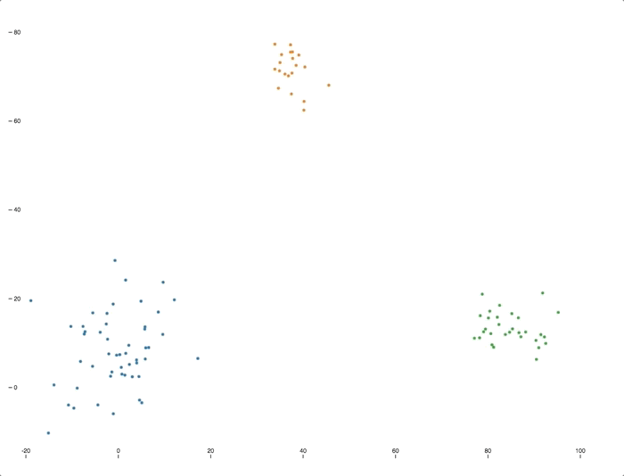

## Clustering Visualization

### Background

Machine learning has become particularly popular in the recent years. Computers are able to perform complex tasks without human interference. We wanted to introduce the basics of machine learning.

For our project, we have decided to build data visualizations of a machine learning algorithm called K-means clustering. We want to provide an intuitive visual for this popular algorithm. The goal of this algorithm is to find groups in the data, with k number of groups. This algorithm works iteratively to assign data points to a group based on similarities. K-means clustering is an example of unsupervised learning, where data has not been explicitly labeled.

Clustering is often used in the industry to study user purchase behavior or group images and videos.

### Functionality & MVP
- [ ] Display D3 visualization of k-means clustering algorithm in 2D and 3D diagrams
- [ ] Users can scroll through page to view different points in the algorithm
- [ ] Complete narrative/description of each point in the clustering algorithm
- [ ] Design a clean user interface including animations for the 2D and 3D diagrams

### Wireframes

### Technologies & Technical Challenges

This data visualization will be implemented using:
- Django as our backend framework
- PostgreSQL as our database
- D3 to create our 2D and 3D visualization
- CSS/HTML for styling the webpage

The primary technical challenges will be:
- Finding a suitable dataset for display (attributes must be as descriptive as possible)
- Learning to create animated diagrams using D3

The data visualization will be created on our own k-means clustering algorithm, in 2 dimensions and 3 dimensions. We will be displaying intermediate steps in the algorithm to show the process. Our final goal is to have our algorithm group all the data points into clusters based on similar attributes.

### Things We Accomplished Over the Weekend
1. Prepared the sample data set to learn how to use D3
- Followed online tutorials to help guide us through the process
2. Used D3 to visualized our sample data set in 2D

3. Learned basic Python and Django to prepare for the week's work
4. Setup our flex project repo on Github

### Implementation Timeline
To allow this project to be productive as well as a successful learning experience, we have to rotate roles during the week. All of us will help in the frontend design of the project as well as participate in writing the algorithm. This way, by the end of the week, we will all have an understanding and know how to use Python, Django, and D3.

**Day 1**: Get started on the infrastructure of the project and begin implementing our cluster algorithm
- Will have the dataset finalized which we will be representing for our project (Hui)
- Begin implementation of k-means clustering algorithm (Wen)
- Setup the PostgreSQL database/seed database and help with clustering algorithm (Clare)

**Day 2**: Work on Django backend and 2D clustering visualization
- Setting up the backbone of Django and writing necessary methods (Hui)
- Begin using D3 to create 2D visualization (Wen)
- Start working on the narrative/description of our webpage - outline (Clare)
- Setup basic webpage design (all)

**Day 3**: Continue working on 2D visualization and begin 3D visualization
- Finish 2D visualization if incomplete from day 2 (Clare)
- Begin 3D clustering display using D3 (Hui)
- Should be able to show the final result of the clustering algorithm in our visualizations (all)
- Continue working narrative/description - hopefully finish that by the end of the day (Wen)

**Day 4**: Dedicate to designing/finalizing the webpage
- The narrative will match up with different points of the clustering algorithm (all)
- Continue 3D clustering visualization and include on webpage

**Day 5**: Final touchups/Production README
- Work on production README.md and push to Github (all)
- Setup Github Pages to have live link (Clare)
- Implement edits as needed for final webpage (all)

### Bonus features:
- Compare and contrast time complexity with other clustering algorithms
